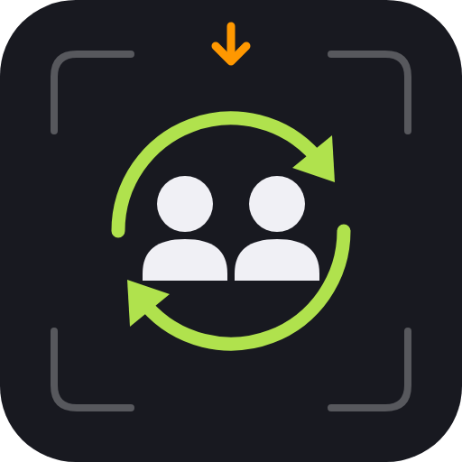

# Collaborator

An editor window (View ▸ Collaborator) that connects to your team's self-hosted
[Collaborator server](https://github.com/zeljkovranjes/sbox-collaborator-server). It shows who is
online and what they and their coding agents are working on, and lets you claim tasks, reserve files
and assets, send messages and log test results, plus "what changed while you were away". Open scenes
are reserved, compile results shared and playtests logged automatically. For s&box teams who work
alongside each other and alongside coding agents.

## Requirements

- A running Collaborator server, its **server address** and a **server key** (`sbj_…`) from whoever
  runs it.
- A GitHub account (sign-in).

## Install

Not on the library manager (org `local`). Copy or `git clone` this folder into your s&box project's
`Libraries` folder, so you have `Libraries/collaborator/collaborator.sbproj`, then open the project in
s&box: it compiles the library automatically.

## Quick start

### In the editor

1. Open **View ▸ Collaborator**.
2. Enter the server address, e.g. `mcp.example.com`, and click *Continue*.
3. Paste the server key and click *Continue* (already have an account? *I already have an account*).
4. Click *Login with GitHub*, log in in the browser that opens. The editor connects by itself, and
   signs you in automatically next time you open s&box.

Everyday use:

| You want to… | Do this |
|---|---|
| see who's online and what they're doing | the **Home** tab |
| know what changed since you last looked | the *While you were away* card on Home, or **⋯ ▸ Catch me up** |
| take a task | **Tasks** tab ▸ click a task ▸ *Claim* (the branch command is copied for you) |
| stop mid-task and leave a note | open your task ▸ *Hand off…* |
| stop teammates editing a file you're changing | right-click it in the Asset Browser ▸ **Collaborator ▸ Reserve file for editing** |
| see who touched a file | right-click it ▸ **Collaborator ▸ History…** |
| message a teammate | the **Messages** tab |
| log a playtest by hand | the **Tests** tab |

Sign out or switch project from the **⋯** menu.

### In code

Editor-only, no code API.

## Options

In the window's ⚙ (Settings) tab, per project:

| Option | Default | What it does |
|---|---|---|
| Sync automatically (Asset sync) | on | Uploads your asset list and what each asset references (paths only), so agents can ask what uses what. |
| Reserve open scenes and prefabs | on | Reserves scenes and prefabs while they are open here; closing releases them. Never overrides a teammate. |
| Share compile results | on | Tells the team when your code stops compiling or compiles again, with the first errors. |
| Share playtest results | on | Logs each play session longer than 5 s, with any errors from while you played. |

You always get a warning when you open or change something a teammate has reserved.

## How it works

The editor registers itself on the server as an `sbox-editor` agent session, links the open s&box
project to a server project by its package ident, and keeps a live event stream (SSE) open so
teammates' tasks, reservations and messages appear immediately. Reservations warn, they never lock.
Your personal access key is stored encrypted outside your project (Windows DPAPI, macOS Keychain,
Linux keyring, or an encrypted file), so it can never end up in git; the server key is not stored at
all. If the connection drops, the window shows it and reconnects by itself.

## Multiplayer

Not applicable: editor-only, nothing runs in a game or syncs over s&box networking. Collaboration
goes through the Collaborator server.

## Limitations

- Needs a self-hosted Collaborator server; there is no hosted service.
- Reservations are advisory: they warn, they don't block edits.
- Not published on the library manager; install by copying the folder.

## Development

- `sbox-check` (workspace standard).
- `dotnet build dev\CompileCheck.csproj`: compiles `Editor\` against your installed s&box.
- `powershell -ExecutionPolicy Bypass -File dev\editor-gate\run_editor_gate.ps1`: the end-to-end
  test in the real editor against a throwaway server (needs the server repo next to this one). See
  [dev/editor-gate/README.md](dev/editor-gate/README.md).

There are no unit test projects.

## License

No license file in this repository yet.
